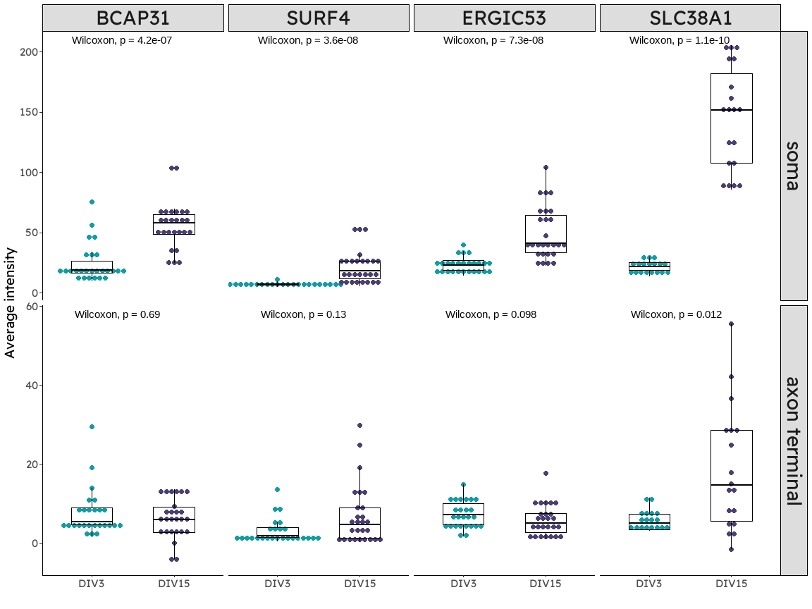

<!--chapter:end:index.Rmd-->

# Acknowledgements {.unnumbered #ACKNOWLEDGEMENTS}
```{=latex}
\markboth{ACKNOWLEDGEMENTS}{}
```

<!--chapter:end:text/Acknowledgements.Rmd-->

# Abstract {.unnumbered #ABSTRACT}
```{=latex}
\markboth{ABSTRACT}{}
```

Protrudin — a transmembrane scaffold protein found in tubular regions of the endoplasmic reticulum (ER) — has previously been shown to strongly promote neuronal survival and axon regeneration after central nervous system (CNS) injury.  This is in part due to increased levels of integrins in the distal axon, but this mechanism does not fully account for its beneficial effects.  We have investigated protrudin's effects on intracellular transport, morphology, and protein localisation in neurons, and found varied but specific effects on different cellular systems.  In particular, protrudin does not have any effect on the transport of late endosomes in CNS neurons — despite evidence for this mechanism in other cell types — due to the absence of key adaptor protein FYCO1 in mature neurons.  It also does not have any substantial effect on dendritic spine morphology, so it does not indiscriminately promote cellular outgrowth.  On the other hand, protrudin does interact with ER export and associated secretory machinery.  Overexpression of an active mutant of protrudin increases the amount of an ER-Golgi intermediate compartment in axon terminals, and affects the transport of Golgi satellite organelles, which we observed even in the distal axon.  Our data demonstrates that protrudin provides axons with the machinery for local membrane protein synthesis, which may play a role in neuron survival and regeneration.  This work opens up new avenues for future research into adult CNS repair.

<!--chapter:end:text/Abstract.Rmd-->


```{=latex}
\tableofcontents
```

<!--chapter:end:text/TOC_manual.Rmd-->

---
output:
  pdf_document: 
    latex_engine: xelatex
  html_document: default
  word_document: default
bibliography: "C:/Users/fl299/PhD/Writing/Thesis/bib/THESIS.bib"
csl: "C:/Users/fl299/PhD/Writing/Thesis/bib/plos.csl"
papersize: a4
fontsize: 12pt
linestretch: 1.15
always_allow_html: true
---

# Introduction {.unnumbered #INTRODUCTION}

```{=latex}
\markboth{INTRODUCTION}{}
```


## The challenge of CNS regeneration

One of the greatest challenges of modern medicine is how to promote regeneration of the central nervous system (CNS).  Compared to most other tissues and organs in the human body, the CNS has exceptionally low regenerative ability.  As a result, damage to the CNS - whether through trauma, infection, or disease - often results in lifelong disability.  In contrast, the peripheral nervous system (PNS) is capable of substantial regeneration after injury, with severed nerves able to regrow several centimetres, reach their targets, and form functional connections, suggesting that regeneration of the CNS might be medically possible, if we can identify the relevant factors at play.  While there has been active research in this area for decades (if not centuries), we are still a long way from what most people would consider 'successful' regeneration of damaged CNS tissues - the regrowth of damaged neuronal processes, appropriate remodelling of the extracellular environment, and restoration of functional synaptic connections.  In this section, I will summarise our current understanding of some of the factors limiting CNS regeneration, as well as the particular challenges I have decided to address with this project.

### Glaucoma

Glaucoma is the leading cause of irreversible sight loss worldwide.  It is estimated that over 3.5% of the world population aged 40-80 is affected by glaucoma, which has an enormous impact on quality of life for millions of people [@thamGlobalPrevalenceGlaucoma2014].  While we do have drugs that can slow or even halt the progression of this disease, they cannot reverse damage that has already occurred, and the typical progression of glaucoma (with sight loss beginning at the periphery) means that it is often diagnosed at a late stage.  Furthermore, up to 10% of people do not respond to the first line treatment drugs, so there is a significant need for improved therapies [CITE].

While many approaches so far have targeted the increased intraocular pressure typically considered a hallmark of glaucoma, there are cases where degeneration occurs despite normal pressure in the eye, and it is not entirely clear what drives the disease progression in these cases [CITE].  Therefore, it is important to develop therapies that can target the neurodegeneration directly, rather than just intraocular pressure.  To that end, we have been investigating how to prevent degeneration of the retinal ganglion cells, and how to promote regeneration of cells that are already damaged.  By delving into the biology of why CNS neurons fail to regenerate and how we can change this, we hope to introduce a new class of therapeutics that can be applied both to glaucoma and to other CNS diseases or injuries.


## Factors limiting CNS regeneration

In 1980, Peter Richardson and colleagues at McGill showed that axons in a severed rat spinal cord could regenerate into an implanted sciatic nerve graft, thus demonstrating that CNS neurons were at least somewhat capable of regeneration, but were inhibited by their environment [@richardsonAxonsCNSNeurones1980].  There are a variety of environmental factors that can limit CNS axon growth, ranging from differences in the cellular composition of PNS and CNS tissues, to changes in the extracellular environment and cell surface receptors that occur as an organism ages.

However, other studies have shown that changes *within* neurons also present a barrier to CNS regeneration.  As the cells mature from a developmental, growth-permissive state into mature, synaptically active neurons, they undergo structural and functional changes that in many cases seem incompatible with regeneration.  Additionally, many neurodegenerative diseases stem from genetic or functional disruption within neurons, as opposed to the extracellular environment.  Understanding and addressing these intrinsic sources of dysfunction and barriers to regeneration is essential to developing successful therapies for CNS protection and regeneration.


### Synaptogenesis

Recent work has increasingly pointed to the formation of synapses as the key point at which developing CNS neurons lose their capacity to regenerate.   During this process, interactions with the external cellular environment trigger internal changes that encourage signalling function at the expense of inhibiting growth.  For example, [@tedeschiCalciumChannelSubunit2016] showed that a voltage-gated calcium channel subunit prevents axon growth, and that inhibiting the channel can promote regeneration *in vivo*.  [@hiltonActiveVesiclePriming2022] found a similar effect with presynaptic vesicle-tethering proteins, and also found that cells that were capable of regeneration down-regulated these proteins during axon growth.  

### Cytoskeleton

Neurons undergo dramatic morphological changes during development, eventually forming extremely long, thin, and complex structures that, in some cases, must be carefully maintained for the entire lifetime of the organism.  To make this possible, mature neurons have a dynamic but highly regulated cytoskeleton, particularly in the axon.  However, the structural requirements of the mature, signal-carrying axon are very different from a growing axon, and in the case of axon injury this can prevent successful regeneration.   

A key feature of the mature neuronal cytoskeleton is the bundle of polarised microtubules that forms the backbone of the axon.  This structure is maintained by proteins such as Efa6, which truncates growing microtubules that leave the bundle to reach the axon periphery.  However, this can also inhibit axon outgrowth, which might limit regeneration [@quEfa6ProtectsAxons2019].  

At the axon tip, a delicate balance of microtubule polymerisation and stabilisation at the axon tip promotes forward extension of the growth cone and axon elongation during development.  This can be partially restored in mature axons with the addition of microtubule-stabilising drugs, but the effect is highly dose-dependent, with higher doses instead inhibiting axon growth (reviewed in [@blanquieCytoskeletonDynamicsAxon2018]).


### Signalling

Many of the internal changes that occur during neuronal maturation are regulated through distinct signalling pathways, which help switch the cell between growing and quiescent states.

#### PTEN and mTOR

One of the most-studied signalling pathways in the context of CNS repair is the PI3K/AKT/mTOR pathway.  The levels of PIP~3~, an important signalling lipid, are developmentally regulated in neurons.  PIP~3~ is produced from PIP~2~ by PI3K, while the reverse reaction is catalysed by PTEN.  During growth, a balance of both enzymes maintain sufficient PIP~3~ levels to promote growth via AKT kinase and downstream targets such as mTOR.  As neurons mature, however, expression levels of PI3K decline, while PTEN remains high.  The result is a decline in PIP~3~, and subsequent decrease in AKT signalling.  Restoring PIP~3~ levels in mature levels, either through PTEN deletion or PI3K expression, can strongly promote axon regeneration[@parkPromotingAxonRegeneration2008; @nieuwenhuisPI3kinaseDelta2020; reviewed in @nieuwenhuisPromotingAxonRegeneration2022].


#### Other signalling pathways

Numerous other pathways have also been implicated in the failure of regeneration in the CNS.  [@smithSOCS3DeletionPromotes2009] found that SOCS3 - a negative regulator of cytokine signalling - inhibited axon regeneration in mouse RGCs by blocking responses to external growth factors, and that deleting SOCS3 promoted regeneration.  [@qiuSpinalAxonRegeneration2002] showed that DRG regeneration into the CNS following a conditioning lesion was dependent on cAMP and PKA to overcome inhibitory signals from the extracellular environment.  These pathways all overlap or interact to some degree, but it is still unclear how they may be differentially regulated in the case of axonal injury, or if this varies across cell types.


### Epigenetic and transcriptional regulation

Dorsal root ganglia (DRG) neurons are unique in that they extend axons into both the peripheral and central nervous systems.  As peripheral neurons, they are capable of axonal regeneration, although this is usually only successful in the peripheral branch, due to the inhibitory extracellular environment of the CNS.  However, their regenerative capacity in the CNS is vastly enhanced by a prior injury to the peripheral axon.  Changes in gene expression and regulation that occur in the weeks following a peripheral lesion can allow these cells to regenerate through the inhibitory environment of a spinal cord lesion, raising the possibility that similar changes could convey similar capacity in neurons of the CNS [@neumannRegenerationDorsalColumn1999].  

This 'conditioning lesion' phenomenon in DRG neurons has provided an invaluable model to identifying epigenetic and transcriptomic changes that permit PNS regeneration but are normally lacking in the CNS.  For example, [@puttaguntaPCAFdependentEpigeneticChanges2014] found that histone modification was essential for the conditioning lesion effect, and activated signalling cascades to promote axonal growth.  [@wengIntrinsicEpigeneticBarrier2017] found that DRG neurons upregulate TET3 after axon injury, which in turn demethylates DNA and allow the activation of regeneration-associated genes.  They also found that the regeneration induced by PTEN deletion in RGCs was dependent on TET1, a similar protein.  

Other work has identified transcription factors that may play a role in axon regeneration.  [@mooreKLFFamilyMembers2009] suggest that different members of the KLF family of transcription factors differentially regulate the regenerative capacity of RGCs, while [@ewanAscendingDorsalColumn2021a] pointed to ATF3 and c-Jun as key regulators.  This is by no means an enhaustive list, and a significant amount of work is ongoing in this area to identify genes that can potentially be targeted to promote regeneration.


### Intracellular transport

After synapse formation, axons undergo dramatic changes in transport, as much growth machinery is excluded in favour of synapse components and synaptic vesicle precursors.  This results in decreased transport of some essential organelles, which can inhibit survival and regrowth in the case of injury.

#### Recycling endosomes

Among the organelles excluded from mature axons are Rab11 recycling endosomes.  While they play a key role in recycling internalised receptors to the plasma membrane, they also transport cargo into axons [@kosekiSelectiveRab11Transport2017].  One such cargo is integrins, which are essential for focal adhesion formation and axonal growth.  In DRG neurons, integrin $\alpha9$ can promote axon regeneration even into the inhibitory environment of the spinal cord [@cheahExpressionActivatedIntegrin2016].  However, integrins are excluded from mature CNS axons by small GTPase Arf6 and its activator Efa6.  Inhibiting Efa6 allows integrins into the axon and promotes regeneration after axotomy *in vitro* [@evaEFA6RegulatesSelective2017].

#### Mitochondria

Similar changes in mitochondrial motility have been identified.  [@lewisProgressiveDecreaseMitochondrial2016] found that mitochondrial motility decreased with age in cortical neurons, and mature mitochondria were often stationary near presynapses.   [@sainathChondroitinSulfateProteoglycans2017] found that chondroitin sylphate proteoglycans - key components of the CNS extracellular matrix, and potent inhibitors of axon regeneration - prevented mitochondria from reaching the growth cones of regenerating DRG neurons.  [@zhouFacilitationAxonRegeneration2016] linked this change even more directly to axon regeneration, showing that artificially enhancing mitochondrial transport into axons could boost regeneration, albeit in the PNS.


### The virtuous cycle of axon growth

Many of these intrinsic factors interact in what has been described as the 'virtuous cycle of axon growth' [@petrovaVirtuousCycleAxon2018].  As explained in detail in that review, changes in axon transport with neuronal maturation lead to lower levels of growth factor receptors in the distal axon.  This in turn mutes the cell's responses to growth factors in the extracellular environment, and prevents the activation of growth-promoting transcription and signalling cascades.  By targeting any stage of this cycle - or indeed multiple stages - it should be possible to restore mature neurons to a growing state and allow regeneration.


## Protrudin {#intro-ptdn}

Protrudin is an interesting protein in the context of axon regeneration because it sits at the nexus of several of these intrinsic systems that can prevent regeneration.  As a result, targeting protrudin has the potential to substantially influence a neuron's regenerative capacity by synergistically acting on multiple different pathways.

### Structure and localisation

 

Protrudin is a transmembrane ER protein.  It contains an intramembrane hairpin loop, which restricts its localisation to tubular domains of the ER, where it might contribute to shaping maintaining membrane curvature (CITE).  It contains an array of binding domains exposed to the cytoplasm, which include a Rab-binding domain (RBD), an FFAT domain, which interacts with VAPA/B at ER contact sites, a coiled-coil (CC) domain, which binds kinesin, and a FYVE domain, which interacts with phospholipids.  There is also a predicted low-complexity region between the hairpin and CC domains, which has been shown to mediate interaction with Rab7 [@raiborgRepeatedEREndosome2015].


### Cellular outgrowth, migration, and invasion

Protrudin, otherwise known as ZFYVE27, is so named because its overexpression induces the growth of long cellular protrusions in HeLa cells [@shiraneProtrudinInducesNeurite2006].  Subsequent work has shown similar effects on a number of cell types [@zhangRoleSpastinProtrudin2012], and indicated a role for protrudin in outgrowth-dependent processes, such as migration and cancer cell invasion [@aroraProtrudinRegulatesFAK2022; @pedersenProtrudinmediatedEREndosome2020].  However, the underlying mechanisms of these effects are not fully understood, and there are a number of potential pathways that could contribute.

### Transport{#intro-ptdn-transport}

Protrudin contains a kinesin binding site, indicating a role in mediating motor protein-mediated transport.  In particular, this would promote plus-end directed transport, which is essential for delivering cargo into the long axons of CNS neurons.  Matsuzaki et al. [@matsuzakiProtrudinServesAdaptor2011] studied this in some depth, and found that protrudin's outgrowth-promoting effect in HeLa cells is attenuated if KIF5 is inhibited, and increased if KIF5 is also overexpressed.  They found evidence for direct protrudin-KIF5 interaction in mouse brains, and identified protrudin as the KIF5 adaptor for SURF4, Rab11, VAPA/B, and RTN3.  As these proteins are essential for ER function, contact site formation, protein transport, and a number of other processes, this suggests that, even at the low levels found endogenously in CNS neurons (CITE), protrudin plays an important role in normal axonal function.

Petrova et al. [@petrovaProtrudinFunctionsEndoplasmic2020], which I contributed to during the first year of my PhD, looked at protrudin specifically in the context of integrin transport.  In particular, integrin $\alpha9$, which is capable of promoting axon growth in the mature spinal cord [CITE], is a cargo of Rab11 endosomes [CITE].  We found that protrudin overexpression had a small effect on developmental neurite outgrowth, but strongly promoted axon regrowth after axotomy *in vitro*.  In addition, protrudin prevented retinal ganglion cell death after an axon crush injury *in vivo*, and allowed axons to regrow past the injury site.  I discuss this result further in Chapter 1, section \@ref(protrudin-ONC).

In contrast, Raiborg et al. [@raiborgRepeatedEREndosome2015] looked at protrudin's effect on late endosome transport.  Using PC12 cells, they found that protrudin *indirectly* promoted late endosome transport, forming transient ER-late endosome contacts at which a separate adaptor, FYCO1 (ZFYVE7), was able to bind Rab7 and KIF5 to move late endosomes down the axon.

### ER contact sites

Other studies have indicated a direct role for protrudin at ER-organelle membrane contact sites (MCS).  Protrudin interacts with VAPA/B, key tethers at many MCS [@saitaPromotionNeuriteExtension2009]; @matsuzakiProtrudinServesAdaptor2011; @hashimotoProtrudinRegulatesEndoplasmic2014; @elbaz-alonPDZD8InteractsProtrudin2020].  It may also act at ER-mitochondrial contact sites, which are important for axonal function and growth [@elbaz-alonPDZD8InteractsProtrudin2020; @leeIncreasedERMitochondria2019], and may be disrupted in neurodegenerative disease (reviewed in [@bernard-marissalEndoplasmicReticulumMitochondria2018]).  In addition, protrudin itself has been shown to act as a tether at ER-endosome contact sites, as it contains a phophoinositide-binding FYVE domain, as well as several motifs that can bind Rab proteins [@raiborgRepeatedEREndosome2015].  It may also play a role in ER-plasma membrane contacts, as protrudin contains a non-canonical FYVE domain that interacts more strongly with PM lipids than those more abundant on endosomes [@gilPhosphoinositidesDifferentiallyRegulate2012].  

### Axonal ER{#intro-ptdn-axonalER}

The axonal ER is comprised of only a few very narrow, continuous tubules, and yet is essential for normal axonal function.  As protrudin localises to ER tubules, it can be found in the axon, although in mature neurons it is more abundant in the cell body and dendrites.  However, it is not excluded from the axon, as it readily moves into the axon if overexpressed [@petrovaProtrudinFunctionsEndoplasmic2020].  Nevertheless, protrudin interacts with a number of important axonal ER components, although it remains unclear exactly what function protrudin has in this compartment.  

Protrudin contains a membrane hairpin domain, which is shared with other proteins that play a role in ER membrane shaping [@changProtrudinBindsAtlastins2013].  Several of these are implicated in hereditary spastic paraplegias (HSP), a group of axon degenerative diseases, which may stem from fragmentation of the axonal ER [@yalcinModelingAxonalEndoplasmic2017].  Protrudin itself has been considered an HSP gene [@mannanZFYVE27SPG33Novel2006], although there is some controversy in this area, and the 'mutation' involved may actually be a benign polymorphism [@martignoniRoleZFYVE27Protrudin2008].  However, protrudin does interact with spastin, atlastin, and other HSP proteins, so it may still play a role in these conditions[@changProtrudinBindsAtlastins2013].  

While dysfunction of these ER-shaping proteins can lead to axonal degeneration, their function is also required for axon regeneration, where they appear to concentrate ER tubules near the growing tip [@raoSpastinAtlastinER2016].  Protrudin may act in the same way, as [@petrovaProtrudinFunctionsEndoplasmic2020] found that protrudin increases the amount of ER in growth cones.

The axonal ER also acts as a local calcium store, and its capacity is regulated by membrane shaping proteins via tubule diameter.  Protrudin may act in the same way, although it is unclear how this may or may not contribute to protrudin's regenerative function, as different ER-shaping proteins have been shown to have opposing effects on axon regeneration [@konnoEndoplasmicReticulumMorphological2021; @alhajlahOverexpressionReticulonEnhances2021].


### Previous work on protrudin

With these diverse roles across numerous cellular functions, protrudin could be influencing neuronal survival and regeneration through several different mechanisms.  Our lab has been working with protrudin for some time now, having initially become interested in the protein in the context of integrin transport.  This led to the publication of [@petrovaProtrudinFunctionsEndoplasmic2020], which I contributed to, some of which is presented in section \@ref(protrudin-ONC).

This paper presented a number of key findings, which I have built upon over the course of this project.  The foremost of these is that protrudin overexpression has a striking effect on neuronal survival and regeneration after axon injury.  

My initial aim in starting this project was to further examine the effect of protrudin on *in vivo* CNS injury, with an aim towards developing it further as a gene therapy.  Unfortunately, the 2020 coronavirus pandemic and associated disruption necessitated a dramatic change in direction, and I have subsequently focused on understanding which cellular pathways contribute to protrudin's beneficial effects.  This is primarily intended to inform the translation of protrudin as a gene therapy for neurodegenerative conditions and CNS injury, although it also lays the groundwork for identifying new therapeutic targets in the same pathways.


<!--chapter:end:text/Intro.Rmd-->

---
output:
  word_document: default
  html_document: default
  pdf_document: default
---
# Materials and Methods {.unnumbered #METHODS}

```{=latex}
\markboth{MATERIALS AND METHODS}{}
```

## Plasmids and antibodies
 (INSERT TABLE HERE)


## Other reagents
 (INSERT TABLE HERE)


## Software

Wherever possible, I tried to use free and open source software throughout this project.  All image analysis tasks were carried out in Fiji [@schindelinFijiOpensourcePlatform2012].  Quantitative analysis and statistics were carried out in R [@Rlanguage]. FinchTV and Serial Cloner were used for reading DNA sequences and designing plasmids, respectively.  

Custom R scripts and ImageJ macros were written for individual analysis tasks.  (GITHUB LINK/DOIs)

## Protocols
### Plasmid preparation{#plasmid-prep}

All plasmid preparation was carried out using either DH5$\alpha$ *(New England BioLabs, C2987I/H)* or XL10-Gold *(Agilent Technilogies, 200314)* competent cells.  Cells were transformed using a heat shock protocol, and grown on LB/agar plates with an appropriate antibody for plasmid selection.  Single colonies were then scaled up in LB culture.  Plasmids were purified from *E. coli* cultures using Qiagen Spin Miniprep *(27104)* or EndoFree Plasmid Maxi kits *(12362)* according to the manufacturer's protocols.  All plasmids were dissolved in ultrapure DNAse-free water *(Thermo Fisher, 10977035)* for transfection.

### Cortical neuron cultures

Primary cortical neurons were obtained from embryonic day 18 Sprague Dawley rats. Cortices were dissected in HEPES-HBSS and dissociated with papain for approximately 5 minutes at 37°, followed by DNAse treatment and trituration through a flame-polished glass pipette. Cells were filtered through a 40$\mu$m cell strainer *(Falcon, 352340)* and plated at a density of 200K-400K cells per imaging plate *(Greiner Bio-One, 627860)* or 50-100K cells per acid-washed glass coverslip. (Plates and coverslips were coated with 50$\mu$g/mL poly-D-lysine *(Sigma-Aldrich, P1149)* in borate buffer.)  Cells were grown in MACS Neuro Medium *(Miltenyi Biotec, 130-093-570)*, supplemented with NeuroBrew-21 *(Miltenyi Biotec, 130-093-566)*, GlutaMAX *(Thermo Fisher, 35050061)*, and ITS *(R&D Systems, AR013)* at 37° with 7% CO~2~. 

### Transfection

Cortical neurons were transfected at DIV10 by either magnetofection or calcium phosphate.  We experienced a significant drop in efficiency with the magnetofection reagent early in 2020, and subsequently switched to the calcium phosphate method.

Magnetofection was carried out using NeuroMag Transfection Reagent *(OZ Biosciences, NM51000)*. Briefly, plasmid DNA was incubated at room temperature with the NeuroMag Transfection Reagent in MACS Neuro Medium *(Miltenyi Biotec, 130-093-570)* for 30 minutes. Growth media was removed from the cells and replaced with warmed MACS Neuro Medium and the DNA-complexed NeuroMag Transfection Reagent. The cells were placed on a magnetic plate *(OZ Biosciences, MF10000)* in an incubator (37° 7% CO~2~) for 30 minutes. The transfection mix was then removed from the cells and the growth media reapplied.

Calcium phosphate transfection was carried out using a protocol adapted from [@jiangHighCaPhosphate2006].  A solution of DNA and calcium phosphate was prepared, and added dropwise to HEPES-buffered saline *(Sigma-Aldrich, 51558)* while vortexing to precipitate the DNA-calcium phosphate complex.  This was then added to the cells in supplement-free media, and incubated at 37° 7% CO~2~ for one hour.  Cells were then washed with media pre-equilibrated in 10% CO~2~ to remove residual precipitate, and the original growth media reapplied.

### Immunocytochemistry{#immuno}

Cortical neurons were fixed using formaldehyde and sucrose, dissolved in PBS and mixed into the growth media to final concentrations of 3% formaldehyde and 10% sucrose.  HeLa cells were fixed in 3% formaldehyde in PBS.  In both cases, cells were fixed for 15 minutes at room temperature, followed by PBS washes and stored at 4$^{\circ}$.  

Cells were permeabilised with 0.2% saponin, used throughout the staining process, to preserve the localisation of membrane-associated proteins.  Dishes or coverslips were incubated at room temperature for 45 minutes in blocking buffer containing 3% BSA and 0.2% saponin.  Primary and secondary antibodies were diluted to the desired concentration in the same buffer and incubated for 1.5 hours each at room temperature, before being rinsed in PBS and stained with DAPI.  All samples were mounted with FluorSave reagent *(Calciochem, 345789)* and left to dry for at least 24 hours before imaging.


### Microscopy

Live imaging of axonal transport was carried out with spinning disc confocal microscopy, using an Olympus IX70 microscope and a PerkinElmer UltraVIEW scanner controlled with MetaMorph software.  The microscope was enclosed and maintained at 37° with supplemental CO~2~ during imaging.  For kymographs, the axons of DIV14-16 neurons were imaged for approximately three minutes at least ~500$\mu$m from the cell body.  

High resolution images of fixed cells were obtained with a Leica DMI4000B confocal or Leica DMI6000B epifluorescent microscope, running LAS-AF software.  


### Image analysis

All image analysis was conducted in Fiji.  In most cases, custom macros were used for batch processing and streamlining manual tasks.  

All manual image analysis was conducted blind, with the exception of figure \@ref(fig:LC3-full-figure), panel (LC3 FIG NEURON PANEL), where cells were classified while they were being examined on the microscope.  In most cases, blinding was achieved using the `blinds` R package to replace descriptive file names with unique identifiers, which can then be reversed after manual analysis.  While I wrote the package for this project, it is generally applicable and publicly available on GitHub (CITE, GET ZENODO DOI).  Where it was not possible to obscure the file names (e.g. where ROIs were being matched to images by name), steps were taken in the analysis macros to randomise image order and hide the experimental condition.


#### Kymograph analysis

Kymographs were generated using the Fiji Multi Kymograph package.  We tested KymoButler [@jakobsKymoButlerDeepLearning2019] for automated kymograph analysis, but found that it did not consistently pick up the small, fast-moving particles common in our lysosome and late endosome data.  As a result, kymographs were manually traced in Fiji using the segmented line tool, with a custom macro to export the data in CSV format for analysis in R.


### Statistical analysis

The Shapiro-Wilk test was used to examine data normality.  As the vast majority of data was not normally distributed, the decision was made to use non-parametric tests throughout.  Kruskal-Wallis or Wilcoxon rank-sum/Mann-Whitney tests were selected as appropriate based on the number of groups.  Post-hoc analysis to identify significant pairings was carried out using Dunn's test with Bonferroni correction for multiple comparisons.

<!--chapter:end:text/Methods.Rmd-->

---
output:
  pdf_document:
    latex_engine: xelatex
  html_document: default
  word_document: default
bibliography: "C:/Users/fl299/PhD/Writing/Thesis/bib/THESIS.bib"
csl: "C:/Users/fl299/PhD/Writing/Thesis/bib/plos.csl"
papersize: a4
fontsize: 12pt
linestretch: 1.15
always_allow_html: true
---

# Protrudin's effect on neuroprotection through lysosome and late endosome transport
\chaptermark{Lysosome and late endosome transport}


## Introduction

### The many roles of neuronal lysosomes

Lysosomes have traditionally been regarded as the degradative compartment of the cell, responsible for the final breakdown and recycling of excess or damaged proteins and organelles.  While this is certainly true, more recent work has shown that they are in fact a diverse pool of complex, multi-functional organelles.  While lysosomal function is essential to cellular survival broadly, it is particularly critical in neurons, which have additional metabolic, signalling, and transport constraints imposed by their extreme morphology.  As a result, normal activity and transport of lysosomes is a key factor in neuronal survival, and disruption of either of these processes can lead to neurodegeneration.

Lysosomal dysfunction is implicated in a wide range of neurodegenerative diseases, including Alzheimer's disease, Parkinson's disease, and ALS.  In many cases, defects in lysosomal degradation of autophagosome contents (a process which occurs in tandem with retrograde transport in axons, as reviewed in Ferguson, 2019 [@fergusonNeuronalLysosomes2019]) are thought to cause the accumulation of damaged organelles, which eventually leads to axonal swellings and subsequent degeneration [@dehayPathogenicLysosomalDepletion2010; @leeLysosomalProteolysisInhibition2011; @xieEndolysosomalDeficitsAugment2015].  Other conditions have been linked to impaired transport leading to decreased availability of lysosomes in the axon [@roneyLipidmediatedMotoradaptorSequestration2021].  Understanding how lysosomes function in neurons and the processes controlling their transport is therefore an important step in developing new protective or regenerative therapies for the CNS.


#### RNA transport

In recent years, a substantial body of evidence has emerged for lysosomes and closely related late endosomes facilitating RNA transport in neurons.  mRNA transport, and subsequent local protein synthesis, is essential for axon growth, pathfinding, maintenance, and synapse formation (reviewed in Cioni et al., 2018 [@cioniMolecularControlLocal2018]). 

Cioni et al. demonstrated that ribonucleoproteins in the axon often associate with Rab7-marked late endosomes, and that these endosomes act as sites for local translation.  Furthermore, these late endosomes can form contact sites with mitochondria, where they are involved in the local translation of proteins for mitochondrial maintenance [@cioniLateEndosomesAct2019].  Work by Liao et al. identified the protein ANXA11 as the tether between lysosomes and RNA granules in the axon, and also showed that ALS-associated mutation in ANXA11 interfere with lysosome binding [@liaoRNAGranulesHitchhike2019].  


#### Signalling platform

As an endpoint of several protein degradation pathways, lysosomes are particularly responsive to amino acid levels in the cell, and in turn regulate the cell's response to feeding or starvation through signalling complex mTORC1.  mTORC1 localises to lysosomes, where it can be activated by regulatory proteins that colocalise in the presence of amino acids, in turn leading to increased protein translation and cell growth (reviewed in [@inpanathanLysosomeSignalingPlatform2019]).This process is modulated by lysosome positioning — during starvation, lysosomes cluster near the nucleus, and mTORC1 activity is inhibited.  Feeding allows the lysosomes to transport towards the cell periphery, where mTORC1 activation can promote growth.  Hong et al. found that protrudin was involved in this process, interacting with lysosomes to facilitate anterograde transport [@hongPtdIns3PControlsMTORC12017].   This signalling is especially important in neurons — Poulopoulos et al. found that the majority of mRNA transcripts that they identified as enriched in growth cones contain a TOP motif for mTORC1-dependent translation [@poulopoulosSubcellularTranscriptomesProteomes2019].  Therefore, the location of lysosomes and the regulation of mTORC1 on those lysosomes likely acts as a key gatekeeper of local translation, and the associated axonal functions that depend on it.

Beyond mTORC1, lysosomes also participate in calcium signalling, which is particularly important for neuronal function.  Lysosomes are known to act as calcium stores for the cell, but also participate in a process known as store-operated calcium entry in response to calcium influx.  In this process, lysosomes are exocytosed, inserting N-type calcium channels from their membranes into the plasma membrane and allowing increased calcium entry and subsequent activation of signalling cascades [@huiReleaseCalciumEndolysosomes2015].  Additionally, this exocytosis releases cathepsin B into the extracellular space, which activates matrix metalloproteinase 9 (MMP-9) through cleaving its inhibitor TIMP-1.  Active MMP-9 breaks down components of the extracellular matrix, facilitating cellular growth.  In neurons, this allows dendritic spines to grow in response to activity [@padamseyActivityDependentExocytosisLysosomes2017].  In cancer cells, this underpins the growth of invasive protrusions called invadopodia, a process that has been shown to depend on protrudin, Rab7, and FYCO1 [@pedersenProtrudinmediatedEREndosome2020]. 


#### ER morphology

Recent advances in microscopy have allowed the interactions between lysosomes and the ER to be imaged in unprecedented detail, and shown how lysosomes are involved in shaping the tubular ER network in cells.   Lu et al. demonstrated that, lysosomes moved in response to the cell's nutritional state, they pulled ER tubules with them.  Interfering with the anterograde movement of lysosomes or ER-lysosomal contact sites resulted in fewer tubules and large ER sheets near the nucleus.  In neurons, this led to decreased axonal ER tubules and stunted axon growth [@luStructureGlobalDistribution2020].  Spits et al. showed a similar interaction with late endosomes, where Rab7 and its transport adaptors mediated ER tubule reorganisation, and resulting in a more sparse ER network in response to starvation [@spitsMobileLateEndosomes2021].   

As much as lysosomes help shape the ER, these interactions are reciprocal, and also play an essential role in lysosome morphology.  Disruption of the ER tubule network has been shown to result in the accumulation of large, static lysosomes near the nucleus, and prevent lysosome transport into axons [@ozkanERLysosomeContacts2021].  Other work has shown that association with ER tubules is necessary for lysosomal tubulation and cargo sorting, and that a key protein involved, LRRK2, is implicated in Parkinson's disease [@bonet-ponceEndoplasmicReticulumContributes2022].


### Lysosome transport mechanisms

As lysosomal function is closely tied to the positioning of these organelles in the cell, significant work has gone into understanding how lysosomes are transported.  This has identified a number of distinct, sometimes overlapping pathways that are regulated in different ways.  Work is still ongoing to understand the importance of these different pathways, and how they may interact in different cell types to control late endosome and lysosomal transport.


#### BORC/Arl8b/SKIP

The BORC/Arl8b/SKIP interaction is one of the best-characterised mechanisms involved in lysosome transport, in part because of how many different proteins are involved and their roles in other systems.  In summary, BORC, a complex of eight proteins, is recruited to the lysosomal membrane, where it in turn recruits and activates Arl8b, a small GTPase.  GTP-bound Arl8b can in turn interact with SKIP, which binds to kinesin-1.  This chain of interactions tethers lysosomes to the kinesin motor for transport along microtubules [@guardiaBORCFunctionsUpstream2016].  This process has been shown to mediate anterograde transport of lysosomes in axons [@fariasBORCKinesin1Ensemble2017], and defects in BORC component diaskedin are linked to progressive axonal dystrophy [@snouwaertMutationBorcs7Subunit2018].  In cancer cells, this system has been shown to enhance cell invasiveness, supporting a role for BORC-mediated lysosome transport in cell outgrowth [@wuLysosomalTraffickingMediated2020].


#### Calcyon and other adaptor proteins

While the BORC complex is involved in kinesin-mediated transport, several other adaptor proteins facilitate minus-end directed transport through binding to dyneins.  These include calcyon (which binds to late endosomes and lysosomes)[@shiDyneinBindsStimulates2017; @shiCouplingMicrotubuleMotors2018], RILP (which is a specific adaptor for Rab)[@bucciExpressionAnalysisChromosomal2001], ALG2 (which binds lysosomes in a calcium-dependent manner) [@liMolecularMechanismRegulate2016], and JIP3 and JIP4, which are involved in amino-acid induced lysosomal transport through TMEM55B [@willettTFEBRegulatesLysosomal2017; @gowrishankarOverlappingRolesJIP32021].  This is not an exhaustive list, and a number of other proteins have also been implicated in lysosome or late endosome transport in various different cell types.  The diversity of effector proteins involved in this process likely reflects the importance of lysosome regulation on the function of different tissues and cells, although further work in this area is required to build up a clearer picture.

#### Protrudin

As previously discussed (section \@ref(intro-ptdn-transport)), Raiborg et al. proposed a mechanism through which protrudin promotes anterograde late endosome transport [@raiborgRepeatedEREndosome2015].  Subsequent work expanded this mechanism to lysosomes, and particularly implicated protrudin-mediated lysosomal transport in mTORC1 activation, albeit in non-neuronal cells [@hongPtdIns3PControlsMTORC12017].  Additionally, Since Petrova et al. showed that overexpression of protrudin increased the amount of ER in growth cones, it seemed likely that lysosomal transport might play a role in this process, in keeping with the role of lysosomes in ER transport discussed in section \@ref(intro-ptdn-axonalER) [@petrovaProtrudinFunctionsEndoplasmic2020].

Given the importance of lysosome transport to cell growth and neuronal function, We decided to test whether protrudin overexpression could be increasing axonal lysosome transport.  


## Methods

General cell culture and microscopy methods can be found in section \@ref(METHODS).  Methods for the experiment presented in section \@ref(protrudin-ONC) are published in [@petrovaProtrudinFunctionsEndoplasmic2020].

### Cloning of LAMP1 construct for lysosome^[While LAMP1 labels a variety of lysosome-related organelles [@chengRevisitingLAMP1Marker2018], ranging from late endosomes to degradative autophagosomes, I will refer to LAMP1-labelled organelles as lysosomes throughout this thesis for the sake of brevity.] labelling

The LAMP1-RFP plasmid *(Addgene, 1817)* was modified to replace the existing CMV promoter with a human synapsin promoter to improve expression level in neurons.  Primers (see table \@ref(tab:primer-table)) were designed using the NEBuilder tool (https://nebuilder.neb.com) from New England Biolabs. 
\begin{table}

\caption{(\#tab:primer-table)Gibson cloning primers.}
\centering
\resizebox{\linewidth}{!}{
\begin{tabular}[t]{ll}
\toprule
  & sequence\\
\midrule
plasmid forward & GGTTTAGTGAACCGTCAG\\
plasmid reverse & CGGAACTCCATATATGGG\\
insert forward & AGCCCATATATGGAGTTCCGCTAGACTCTAGCTGCAGAGGG\\
insert reverse & ATCTGACGGTTCACTAAACCTCGACTGCGCTCTCAGGC\\
\bottomrule
\end{tabular}}
\end{table}


Fragments for cloning were produced by PCR, separated on a 1% agarose TBE gel, and purified using the Wizard SV Gel and PCR Clean-Up System kit *(Promega, A9282)*. 20$\mu$L assembly reactions were set up with Gibson master mix *(New England Biolabs, E2611S)* and an appropriate ratio of insert and vector DNA (2:1 or higher) and incubated at 50$^{\circ}$ for 1.5 hours. Assembled constructs were scaled up and successful cloning confirmed with restriction digest and DNA sequencing.

### Calcyon shRNA silencing
Ready-cloned shRNA expression vectors against calcyon were obtained from OriGene *(TG712969)* (see table \@ref(tab:caly-tab)).  The constructs readily expressed in rat cortical neurons (as seen from TurboGFP signal), but proved highly toxic to the cells.  Many cells transfected with either a mixture of calcyon shRNA constructs or the scrambled control shRNA *(Origene, TR30013)* showed complete fragmentation, and the remaining intact cells had abnormally low levels of organelle movement, suggesting low viability.  This experiment was not continued further.

\begin{table}

\caption{(\#tab:caly-tab)Calcyon shRNA sequences.}
\centering
\begin{tabular}[t]{ll}
\toprule
  & sequence\\
\midrule
TG712969A & ATCCGCAGAAGGCGGAGGATGTGCCGTCC\\
TG712969B & TGCGGACCAGCCAAAGAAGTTCGCAGATT\\
TG712969C & CCAGATGGCTTCCTACTTCGGCACAAGAT\\
TG712969D & TCAGCCATCATTCCCTGACCAGGTGGTCA\\
\bottomrule
\end{tabular}
\end{table}

### Lysotracker labelling
We initially tried labelling cells with LysoTracker Red *(Thermo Fisher, L7528)*, using the manufacturer's labelling protocol.  However, the dye was toxic to our neuronal cultures, even at low concentrations.  In addition, the density of our cultures made it difficult to distinguish lysosomes in the neuron of interest from those in overlapping neuronal projections.  As a result, we decided to proceed with transfected fluorescently-tagged markers instead of LysoTracker or other cell-permeable dyes.

### BORC-related constructs for lysosome/late endosome manipulation
Expression constructs for SKIP, myrlysin (BORCS5), WT Arl8b, and constitutively active Arl8b were kindly provided by Juan Bonifacino.  These constructs were scaled up as described in section \@ref(plasmid-prep) and tested for transfection in cortical neurons.  Additional constructs of SYN-myrlysin-EGFP and CBh-SKIP-mNeonGreen were obtained from VectorBuilder and prepared in the same way.

Our original intention was to test if artificially increasing lysosomal transport in the axon could promote regeneration; however, this work was interrupted by the pandemic.  Following our return to the laboratory, we conducted some pilot experiments with SKIP and LAMP1.  This showed some colocalisation between the two, particularly in anterogradely-moving lysosomes, but no immediately obvious differences in number of lysosomes, speed, or run length compared to an EGFP control (figure \@ref(fig:SKIP-LAMP1-kymo)).  (This is not unexpected, as previous experiments required both SKIP and Arl8b overexpression to stimulate transport [@rosa-ferreiraArl8SKIPAct2011; @fariasBORCKinesin1Ensemble2017].)  After the completion of the experiments described in section \@ref(lyso-LE), it was decided not to continue this work further.


 


### Transfection optimisation
As mentioned in section \@ref(METHODS), we experienced a sharp decline in efficiency with our initial magnetofection protocol, and needed to reoptimise our process.  This occurred between the experiments discussed in section \@ref(lyso-LE).  During this time, we tested a variety of protocols and modifications to identify the factors most important for transfection efficiency, using the same EGFP/Emerald expression construct.  Results were measured by scanning the entire plate of cells on a Leica DMi8 tilescan microscope and counting the number of transfected neurons that were either intact or visibly dead.  

 

Of all the factors tested, cell density best correlated with the transfection efficiency, although the improvements on the original magnetofection protocol were dwarfed by the vast improvement with calcium phosphate transfection.  Going forward, transfections were carried out using the calcium phosphate method, with cell density of 200-400K per imaging dish depending on the needs of the experiment.


## Results^[The results presented in this section largely reflect my first year of study, a time when I was also training to perform *in vivo* experiments to assess neuroprotection and regeneration in the eye and optic nerve.  My initial plan was to determine protrudin's effect on lysosome/late endosome transport, and then test a variety of different tools (e.g. calcyon shRNA, BORC overexpression, etc.) to manipulate lysosome and late endosome transport and assess their regenerative potential.  Unfortunately, the cessation of lab work during the pandemic and associated disruptions eventually led us to abandon most of these plans.]

### Protrudin overexpression is neuroprotective following axon injury *in vivo*{#protrudin-ONC}

*The data in this section has been published in [@petrovaProtrudinFunctionsEndoplasmic2020].  My contribution to the experiment included DNA preparation, tissue collection, and data curation.*


The optic nerve crush model is a powerful tool for examining CNS survival and regeneration *in vivo*.  Because the eye and the optic nerve can be accessed much more readily than, for example, the brain and spinal cord, it allows the gene delivery and axon injury to be performed with minimal invasiveness.  In addition, because the bodies of the RGCs are all located together in the retina, it is possible to quantify both cell survival and axon regrowth in the same experiment.

For this experiment, mice received intravitreal injections of AAV2 viruses containing either EGFP only, WT protrudin, or active protrudin under a CAG promoter, followed two weeks later by a unilateral optic nerve crush.  Two weeks post-crush, the mice were perfused, and eyes and optic nerves were collected.  RBPMS staining of retinal flat mounts showed a significant increase in RGC survival with expression of the active protrudin construct, as measured by comparing the number of RBPMS positive cells between the crush and uninjured eyes (Figure \@ref(fig:ONC-figure))[@petrovaProtrudinFunctionsEndoplasmic2020].  

 

This effect was further substantiated by mouse retinal explant experiments, which showed that transfection with either WT or active protrudin completely preserved RGC survival over three days *ex vivo*, compared to an EGFP control which lost approximately 55% of RGCs over the same time. [@petrovaProtrudinFunctionsEndoplasmic2020].

### Protrudin overexpression does not increase lysosome or late endosome transport in the distal axon{#lyso-LE}

We decided to test the hypothesis that protrudin might function in part by increasing the anterograde transport of late endosomes or lysosomes into the distal axon.  As described above, there are a number of ways in which this increased transport could have neuroprotective or regenerative effects, and such a function would be in keeping with protrudin's described behaviour in the literature.  

Cortical neurons were transfected to co-express LAMP1-mRFP1 and either EGFP or EGFP-tagged protrudin, and LAMP1 transport in the distal axon was imaged using spinning disc microscopy.  These videos were then used to generate kymographs (as described in \@ref(METHODS)), which were manually traced to give measures of lysosome number, run length, and transport speed.  Overexpression of either wild type or active protrudin had no significant effect on the number, distance, or direction of travel of lysosomes in the distal axon.  A very slight decrease in anterograde speed was observed in cells expressing active protrudin.

![(\#fig:LAMP1-full-figure)A) Representative axon image and kymographs showing LAMP1 transport in the distal axon of cortical neurons expressing either EGFP (control) or EGFP-tagged protrudin constructs.  Anterograde is to the right for each kymograph.  B) Total number of LAMP1-labelled organelles in each cell imaged.  C) Average run length (per cell) of moving lysosomes.  Anterograde and retrograde were defined as continuous movements of at least 5µm away from or towards the cell body, respectively.  D) Average lysosome velocity (per cell).  P-values are from Kruskal-Wallis test, followed by Dunn's post-hoc test with Bonferroni correction for multiple comparisons.](../figures/full/LAMP1-full-figure-1.png) 

The experiment was then repeated using Rab7 instead of LAMP1 as a more specific marker of late endosomes.  As the mechanism set out in Raiborg et al. suggests that Rab7 is directly involved in protrudin-mediated transport of late endosomes, this should label only the exact population of organelles that are involved in this process [@raiborgRepeatedEREndosome2015].  While overexpression of Rab7 could potentially amplify any effect of protrudin overexpression on this system, this effect should be consistent between control and protrudin conditions.  Cortical neurons were co-transfected with mCherry of mCherry-tagged protrudin and Rab7a-mEmerald, and Rab7 transport imaged and analysed as described previously.  However, this showed no significant effect of protrudin on any measured parameter of lysosome transport.  Importantly, there was no change in the total number of lysosomes or late endosomes with either WT or active protrudin expression, compared to a control.


![(\#fig:Rab7-full-figure)A) Representative axon image and kymographs showing Rab7 transport in the distal axon of cortical neurons expressing either mCherry (control) or mCherry-tagged protrudin constructs.  Anterograde is to the right for each kymograph.  B) Total number of Rab7-labelled organelles in each cell imaged.  C) Average run length (per cell) of moving late endosomes.  Anterograde and retrograde were defined as continuous movements of at least 5µm away from or towards the cell body, respectively.  D) Average late endosome velocity (per cell).  P-values are from Kruskal-Wallis test, followed by Dunn's post-hoc test with Bonfferoni correction for multiple comparisions.](../figures/full/Rab7-full-figure-1.png) 


## Discussion{#no-FYCO}
Somewhat surprisingly, we found that protrudin overexpression had very little if any effect on lysosomal and late endosomal transport in cortical neurons.  However, further examination of the literature provides a likely explanation.  The mechanism described in Raiborg et al. — which used PC12 cells as a model system — relies on the protein FYCO1 as an adaptor to link late endosomes to kinesin for anterograde transport [@raiborgRepeatedEREndosome2015].  This protein, also known as ZFYVE7, contains similar Rab7- and PIP-, and kinesin-binding domains to protrudin.  Raiborg et al. suggest that protrudin brings late endosomes and kinesin together through Rab7 and PI(3)P binding, but then transfers the kinesin onto Rab7-bound FYCO1 to facilitate transport.   However, transcriptomic data from Koseki et al. suggests that FYCO1 is mostly absent from mature rat cortical neurons, which could explain why we see no effect on late endosome transport with protrudin overexpression [@kosekiSelectiveRab11Transport2017].  This is consistent with transcriptomic data from other studies that show extremely low FYCO1 in human cortical neurons, expression biased towards non-neuronal cell types in the brain, and low levels in mouse DRG neurons [@zhangPurificationCharacterizationProgenitor2016; @kelleyVariationIntactTissue2018; @tedeschiCalciumChannelSubunit2016].

 


Of note, Özkan et al. also do not find a link between protrudin and CNS axonal lysosome transport.  They knocked down protrudin in hippocampal neurons, but found no effect on the distribution of LAMP1-labelled lysosomes into the axon  [@ozkanERLysosomeContacts2021].   This supports the idea that protrudin is not involved with late endosome/lysosome transport in neurons, but that other transport mechanisms (e.g. BORC) are predominant in axon transport.

While these findings can effectively rule out late endosome/lysosome transport as a mechanism through which protrudin drives neuroprotection and axon regeneration, they are worth bearing in mind when it comes to clinical translation.  The differential expression of FYCO1 across cell types suggests potential variations in the regulation of lysosome transport between them.  While protrudin overexpression has no substantial effect on this transport in cortical neurons, it could have an impact on other populations, leading to possible undesired effects in non-neuronal cell types.  Any gene therapies incorporating protrudin should therefore be carefully targeted to limit expression in the PNS and glial populations.

It remains an open question whether or not enhancing axonal lysosome transport could promote axon regeneration, for many of the reasons discussed at the start of this chapter.  Further research in this area is required, either targeting transport mechanisms such as BORC or calcyon (which have been demonstrated to act neurons), or through exogenous expression of FYCO1.  In fact, Saridaki et al. have already shown that FYCO1 overexpression in a *Drosophila* model of Parkinson's disease preserves motor function at baseline levels and prevents age-related decline  [@saridakiFYCO1MediatesClearance2018].  (That being said, *Drosophila* does not contain an ortholog for protrudin, so FYCO1 may not have the same effect as it would in a vertebrate model [@wangHereditarySpasticParaplegia2008].)  While FYCO1 is an appealing candidate for further study, due to the possibility of it acting synergistically with protrudin, it might be unfeasible as a gene therapy due to the size of the FYCO1 transcript.  At over 4.4kbp, it is very close to the packaging capacity of most AAV capsids, even without a promoter or other vector elements.  However, a better understanding of FYCO1 function might allow for the development of a shorter functional form with better translational potential.


<!--chapter:end:text/Chapter_1.Rmd-->

---
output:
  pdf_document: 
      latex_engine: xelatex
      keep_tex: true
  html_document: default
  word_document: default
bibliography: "C:/Users/fl299/PhD/Writing/Thesis/bib/THESIS.bib"
csl: "C:/Users/fl299/PhD/Writing/Thesis/bib/plos.csl"
papersize: a4
fontsize: 12pt
linestretch: 1.15
always_allow_html: true
---

# Protrudin's role in regeneration and endogenous functions
\chaptermark{Regeneration and endogenous functions}


## Introduction
As discussed previously in section \@ref(intro-ptdn), protrudin's array of binding domains allow it to participate in numerous cellular systems, with diverse effects.  To identify other mechanisms of action, we decided to take a broad approach, examining a number of different systems to identify how protrudin might influence survival and regeneration in neurons.


### Cellular morphology
While protrudin's role in cell outgrowth is interesting from the perspective of axon regeneration, it could potentially play a number of other roles in neuron morphology.  Given that Petrova et al. showed that endogenous protrudin is more abundant in dendrites than axons in mature neurons, its endogenous functions may well be more apparent here [@petrovaProtrudinFunctionsEndoplasmic2020].  In fact, there are a number of published findings that suggest that protrudin may endogenously function in dendrites, either to control dendritic spine morphology or support synaptic function.  

For example, the mechanism through which protrudin promotes invadopodia formation in cancer cells is functionally extremely similar to how lysosomal exocytosis induces dendritic spine expansion, raising the possibility that protrudin is involved in spine growth [@pedersenProtrudinmediatedEREndosome2020; @padamseyActivityDependentExocytosisLysosomes2017].  However, Pedersen et al. found that this process is dependent on FYCO1 as well as protrudin, which (as discussed in section \@ref(no-FYCO)), is largely absent in CNS neurons [@pedersenProtrudinmediatedEREndosome2020].  On the other hand, protrudin has already been shown to play a functional role at dendritic spines, mediating long term depression by allowing internalised AMPA receptors to be removed from the spine through association with KIF5 [@brachetKinesin1protrudinComplex2021].  In addition, ER tubules (or the more complicated spine apparatus) have been observed either transiently or permanently in most spines on hippocampal neurons [@perez-alvarezEndoplasmicReticulumVisits2020], which also suggests that protrudin is likely to be present in or near spines and could act on their morphology.  Given protrudin's effect in cellular outgrowth, therefore, it is reasonable to expect that protrudin overexpression might have an effect on dendritic spine morphology.

### Functional effects
To further examine protrudin's endogenous roles beyond cellular outgrowth, we turned to the literature to identify published proteomics data sets.  We identified three studies that published lists of protrudin-interacting proteins [@elbaz-alonPDZD8InteractsProtrudin2020; @hashimotoProtrudinRegulatesEndoplasmic2014; @matsuzakiProtrudinServesAdaptor2011].  Each study used a different model system and focused their analysis on different pathways, providing a variety of perspectives.  

Elbaz-Alon et al. looked at protrudin in a human epithelial cell line, where they investigated how protrudin interacts with PDZD8 and contributes to ER contact sites  [@elbaz-alonPDZD8InteractsProtrudin2020].  Hashimoto et al. used mouse brain neurons to look at interactions between protrudin and HSP-related proteins [@hashimotoProtrudinRegulatesEndoplasmic2014], while Matsuzaki et al. used a mouse neuroblast cell line to study the interaction between protrudin and KIF5 [@matsuzakiProtrudinServesAdaptor2011].  Individually, these reveal a number of interesting interactions, indicating diverse roles for protrudin that include but are not limited to axonal function.  Taken together, a substantial level of overlap between the interaction sets reveals a conserved set of cellular functions that may help explain how protrudin promotes survival and regeneration.


## Methods

General cell culture and microscopy methods can be found in section \@ref(METHODS).

### Dendritic spine imaging and analysis
Neurons were co-transfected with mCherry or an mCherry-tagged protrudin construct and EGFP/Emerald.  Cells were imaged as Z-stacks at DIV15, either on the spinning disc at 100x, or confocal at 63x (see \@ref(METHODS) for microscope details).  Image stacks from the green channel were converted to maximum intensity projections, and a custom ImageJ macro was used to select and crop 20$\mu$m sections from a dendrite.  These images were then blinded, and the Cell Counter Fiji plugin was used to count and classify spines.  For spine length, the Fiji segmented line tool was used to measure along each spine.

### Gene ontology analysis
Lists of protrudin-interacting proteins were obtained from supplementary data published with [@elbaz-alonPDZD8InteractsProtrudin2020], [@hashimotoProtrudinRegulatesEndoplasmic2014], and [@matsuzakiProtrudinServesAdaptor2011].  Gene names were standardised across experiments (and between human and mouse data sets) using Bioconductor genome annotations (`org.Hs.eg.db` version 3.15.0 and `org.Mm.eg.db` version 3.15.0).  Gene ontology analysis for biological process enrichment was carried out using the `limma` Bioconductor package in R.

### HeLa cell culture
HeLa cells were expanded before use and cryopreserved in individual vials to prevent genetic drift between batches.

HeLa cells were grown in DMEM *(Thermo Fisher, 41966-029)*, supplemented with 1% FBS *(Thermo Fisher, 10500064)* and antibiotic-antimycotic *(Thermo Fisher, 15240062)*, at 37$^{\circ}$, 5% CO~2~.  For each batch of cells, a single vial was thawed, passaged, and grown to 60-80% confluence before transfection.  Cells were transfected with EGFP or EGFP-tagged protrudin under a CAG promoter, using TransIT-LT1 reagent *(Mirus Bio, MIR2300)*, according to the manufacturer's protocol.  These were then passaged 24h after transfection to reduce overlap between cells and encourage protrusion growth.

Cells were fixed with 3% formaldehyde in PBS for 15 minutes at room temperature.  Immunochemistry was carried out according to the protocol in section \@ref(immuno).  Staining with BODIPY TR C~5~ ceramide *(Thermo Fisher, B34400)* was carried out according to the manufacturer's protocol.  Briefly, cells were incubated with 5$\mu$M dye in DMEM for 30 minutes at 4$^{\circ}$.  They were then recovered in supplemented media at 37$^{\circ}$, 5% CO~2~ for 30 minutes before fixing as usual.


## Results
### Protrudin's effect on dendritic spine number, length, and morphology
Dendritic spines show diverse morphology within and between cells, which is generally considered to be reflective of the maturity, functionality, and plasticity of each spine.  While these ultimately fall on a continuous spectrum of shapes, they are conventionally grouped into four morphological classes — mushroom, thin, stubby, and filopodia [@pchitskayaDendriticSpinesShape2020].  We decided to use these classes to obtain an overview of spine morphology on cells expressing protrudin.  

We counted and manually classified dendritic spines on 20$\mu$m sections of dendrite from DIV15 (n = 30 cells per condition across three batches) or DIV21 neurons (n = 10 cells per condition, one batch) co-expressing an EGFP/Emerald filler with an mCherry-labelled protrudin construct (figure \@ref(fig:spine-type-full-figure)).  These included WT and active protrudin, as well as a set of domain-deletion mutants to act as dominant negatives.  $\Delta$FFAT, $\Delta$RBD, and $\Delta$FYVE each have a single binding motif deleted, $\Delta$KIF5 has both the CC and FFAT domains deleted, to completely block binding to kinesin, and $\Delta$ER mutant ($\Delta$TM1-3) has all transmembrane domains deleted [@petrovaProtrudinFunctionsEndoplasmic2020].  The DIV15 data suggests that WT protrudin might be associated with fewer, stubbier spines, although the significant comparisons varied for each spine classification, and is inconsistent with the DIV21 data.

 

As manual spine classification is an inherently subjective measure, and did not show any clear associations, we decided to look instead at spine length, which can be measured more objectively.  We re-analysed the initial DIV15 data, measuring the length of each spine from the edge of the dendrite.  This did yield some significant comparisons, both in spine number and length, so we followed this up with a full replication, which we analysed in the same way (figure \@ref(fig:spine-length-full-figure)).  While the replication also produced statistically significant results, they were wholly inconsistent between the two experiments.    

![(\#fig:spine-length-full-figure)A-B) Number of dendritic spines counted per 20$\mu$m section in cells co-expressing EGFP/Emerald with an mCherry-tagged protrudin construct.  Replicate 1: n=30 cells per condition across three independent batches, except $\Delta$RBD n = 29, $\Delta$KIF5 n = 20, $\Delta$FYVE n = 19 across two batches.  Replicate 2: n = 40 cells per condition, except WT and $\Delta$ER n = 39, across three independent batches. C-D) Length of each spine measured, in $\mu$m. TODO - GET N VALUES FOR SPINES](../figures/full/spine-length-full-figure-1.png) 


Taken together, these results show that protrudin overexpression does not substantially impact dendritic spine number, length, or morphology.  These measurements were highly variable between cells and between replicates, and did not show any consistent patterns that would suggest that protrudin plays any role in controlling spine outgrowth.  This obviously cannot rule out changes in spine function, but in any case such changes do not seem to be mediated by morphological changes at the micron scale.


### Protrudin's interactions with other proteins in the cell{#GO-analysis}

We identified three published lists of protrudin-interacting proteins from [@elbaz-alonPDZD8InteractsProtrudin2020], [@hashimotoProtrudinRegulatesEndoplasmic2014], and [@matsuzakiProtrudinServesAdaptor2011].  As these studies used distinct methods and model systems, we were most interested in the interactions that were conserved across sets.  After standardising the data across sources, we found 46 protrudin-interacting proteins that were identified in at least two studies.  Gene ontology analysis (biological process enrichment) of this set showed a high representation of genes involved in vesicular transport, and in particular Golgi-related transport ('intra-Golgi vesicle mediated transport', 'Golgi vesicle transport', 'ER to Golgi vesicle-mediated transport', etc.) (figure \@ref(fig:proteomics-full-figure)).   In contrast to endosomal transport, protrudin's role in Golgi-related transport has not been extensively studied, and we decided to follow this up with further experiments.

 


### HeLa screen for changes in organelle distribution

When protrudin is overexpressed in HeLa cells, it drives the growth of long cellular protrusions that superficially resemble developing neurites [@shiraneProtrudinInducesNeurite2006].  While these cells are genetically and functionally very distinct from neurons, this nevertheless provides a useful model system for examining protrudin's interactions with other cellular components.  We used this system to screen for proteins that colocalise with protrusion in these cellular outgrowths, to quickly identify organelles or complexes that could be transported into axons when protrudin is overexpressed in neurons.


Table: (\#tab:unnamed-chunk-1)Markers for HeLa screen.

|Marker                  |Description                   |
|:-----------------------|:-----------------------------|
|BCAP31                  |ER chaperone                  |
|SURF4                   |ERES cargo loading            |
|MIA3 (TANGO1)           |ERES cargo loading            |
|SEC31A                  |COPII coat component          |
|ERGIC53                 |ERGIC marker                  |
|GS28                    |Golgi SNARE                   |
|GLG1                    |Golgi glycoprotein            |
|USO1 (p115)             |ER to Golgi vesicle targeting |
|LAMP1                   |lysosome marker               |
|mTOR                    |signalling kinase             |
|ALSL3                   |fatty acid metabolism         |
|SLC38A1                 |glutamine uptake transporter  |
|LC3                     |autophagosome marker          |
|BODIPY TR C~5~ ceramide |ceramide lipid dye            |


Based on the results of our gene ontology analysis, we selected a panel of antibodies to screen for colocalisation with protrudin in HeLa cells.  These were primarily focused on components of the ER exit site to Golgi secretory pathway, but also included proteins involved in lipid metabolism, signalling, and amino acid transport.

 

Of the ERES-related proteins, different markers showed different levels of colocalisation with protrudin.  BCAP31 and SURF4 were consistently enriched in cellular protrusions, more so than at other areas of the cell periphery.  MIA3 and SEC31A colocalised well with protrudin in the perinuclear area, but were found at lower levels in protrusions, and were less consistent between cells.  At this stage, it was not possible to conclusively say whether these variations represented differences in how ERES proteins were transported or in how effectively the individual antibodies stained these components, so we decided to proceed with BCAP31 and SURF4, which produced more clear results. (Figure \@ref(fig:HeLa-ERES-grid-full-figure))

 

Of the Golgi-related proteins, GS28, GLG1, and USO1 clearly labelled the perinuclear Golgi compartment, but were either entirely absent or found only at very low levels in protrusions.  ERGIC53, on the other hand, was highly enriched in protrusions, in most cases well above the levels seen in the cell body.  This was the strongest concentration with any of the markers used in this screen, and point to the ERGIC compartment not only colocalising with protrudin, but specifically playing a role in the growth of cellular protrusions.  This marker was added to the set (along with BCAP31 and SURF4) to examine in neurons.  (Figure \@ref(fig:HeLa-Golgi-grid-full-figure))

 

LAMP1 and mTOR, which we would expect to move to the cell periphery in response to protrudin overexpression, were present in protrusions at relatively low levels.  While protrudin overexpression did result in more puncta away from the perinuclear cluster, this effect was not especially dramatic, and the highest concentrations were still found near the cell nucleus.  This is in contrast with [@hongPtdIns3PControlsMTORC12017], which found a stronger movement away from the nucleus when expressing Myc-tagged protrudin.  However, their culture protocol differed from ours in adding 2mM supplemental glutamine to the culture media, so the apparent differences could reflect the amino acid dependence of the protrudin-FYOC1 transport mechanism.  (Figure \@ref(fig:HeLa-misc-grid-full-figure), panels A-B)

ACSL3, was found in cellular protrusions, but, similar to MIA3 and SEC31A, was generally at low levels, and varied considerably between cells.  This may reflect on the antibody used, or a more complicated cell-state dependent interaction with other metabolic pathways.  This was not taken forwards.  (Figure \@ref(fig:HeLa-misc-grid-full-figure), panel C)

Finally, SLC38A1, was found to concentrate in protrusions, and similarly to ERGIC53 was found at higher levels here than near the nucleus.  This result is particularly interesting, as SLC38A1 is a potential cargo of the local secretory pathway.  SLC38A1 was added to BCAP31, SURF4, and ERGIC53 to examine in neurons.  (Figure \@ref(fig:HeLa-misc-grid-full-figure), panel D)


In addition to protrusions, protrudin overexpression also induces the formation of large, ring-shaped structures in the perinucear region.  These are observed occasionally in neurons expressing protrudin, but not to the same extent as in HeLa cells.  While these were not the primary focus of this experiment, they did reveal interesting results with two of the markers screened, and may indicate protrudin involvement in non-morphological pathways.

LC3 strongly colocalised with protrudin in these structures, suggesting that they may represent phagophores or autophagosomes (figure \@ref(fig:LC3-full-figure)).  Notably, LC3 is *not* enriched in cellular protrusions (LINK TO FIGURE PANEL), in contrast to the markers discussed above.  This may represent a different pathway activated by protrudin overexpression.  These LC3-labelled structures are also smaller and less abundant in cells expressing only EGFP, suggesting that their formation is influenced by protrudin overexpression.

We followed up this result with a pilot experiment in neurons, co-expressing EGFP-protrudin and mRFP1-tagged LC3.  LC3 showed differences in localisation between cells, ranging from fully cytoplasmic to fully punctate, which likely reflects the conversion between soluble LC3-I and membrane-associated LC3-II [@kabeyaLC3MammalianHomologue2000].  All cells expressing either WT or active protrudin contained at least some LC3 puncta, in contrast to control cells, of which 12.5% had fully cytoplasmic LC3.  This suggests that protrudin might be encouraging autophagosome biogenesis, although further experiments are needed to confirm this result.

![(\#fig:LC3-full-figure)A) Representative image of HeLa cells expressing WT protrudin and stained for LC3.  Inset is 20x20$\mu$m.  B) Fluorescence profile along the dotted line shown in panel A inset.  Note strong correspondence between protrudin (green) and LC3 (magenta) signal.  C) Representative images of neurons expressing mRFP1-tagged LC3 showing range of distribution patterns.  Scale bars are 20$\mu$m.  D) Quantification of LC3 distributions in cells co-expressing EGFP-protrudin and mRFP1-LC3.  n = 40 cells per condition across two independent batches.](../figures/full/LC3-full-figure-1.png) 

BODIPY C~5~ ceramide, a lipid dye often used to label the Golgi apparatus, strongly labelled the lumen of these organelles.   It is not clear in this context whether these are Golgi-related structures or lipid droplets, however it is worth noting that other Golgi markers did *not* colocalise with these structures (e.g. \@ref(fig:HeLa-Golgi-grid-full-figure), particularly visible in panel C).  Given the relationship with LC3 as discussed above, this may indicate an increase in lipophagy, although further experiments would be needed to confirm.

 

## Discussion

### The ERES to Golgi pathway

In non-polarised cells, proteins are typically translated in the ER, released from ERES, trafficked to the Golgi via the ERGIC compartment, and secreted in post-Golgi carriers.  In neurons, several alternate pathways exist, to account for the local translation needs of compartments distant from the cell body.  In dendrites, for example, Golgi outposts and satellites serve some of the same functions as the main Golgi apparatus, acting as local points for protein glycosylation [@mikhaylovaDendriticGolgiSatellite2016].  The ERGIC compartment is also involved in a Golgi-bypassing secretory pathway, which has been observed in dendrites [@bowenGolgiindependentSecretoryTrafficking2017].  It is possible that that same mechanisms could function in axons, providing a mechanism through which protrudin expression could promote secretion and growth in the absence of any changes to the cell body Golgi apparatus.


<!--chapter:end:text/Chapter_2.Rmd-->

---
output:
  pdf_document: 
    latex_engine: xelatex
  html_document: default
  word_document: default
bibliography: "C:/Users/fl299/PhD/Writing/Thesis/bib/THESIS.bib"
csl: "C:/Users/fl299/PhD/Writing/Thesis/bib/plos.csl"
papersize: a4
fontsize: 12pt
linestretch: 1.15
always_allow_html: true
---

# ER, ERGIC, and Golgi in axons
\chaptermark{ER, ERGIC, and Golgi}


## Introduction

The discovery of local secretory pathways in neurons is fairly recent, but has already contributed significantly to our understanding of how these cells develop and function.  In non-polarised cells, protein translation and modification typically take place near the nucleus, and proteins are then transported to their final destination in, on, or outside of the cell.  While this does also occur in neurons, neurons are also capable of locally translating proteins, which can then be delivered to organelles or inserted into the cell membrane as needed [@meriandaAfunctionalequivalent2009].  It has become increasingly apparent that protein delivery from the cell body is not sufficient to maintain protein turnover at distal parts of the cell, nor is it fast enough to support the dynamic behaviour observed in these regions, for example during axon pathfinding.  Instead, these regions rely on several overlapping local pathways for protein production, modification, and secretion (reviewed in [@gonzalezGolgibypassreview2018]).

### ER exit sites and COP vesicles
Key to all of these pathways is the presence of interconnected ER tubules throughout the neuron.  Continuous with the ER network in the soma, these tubules reach into dendrites, into individual spines in an activity-dependent manner [@perez-alvarezEndoplasmicReticulumVisits2020], and down the entirety of the axon.  Among other roles, this ER network provides a platform for local protein translation, and targeting to other organelles for further modification.

Proteins translated in the ER are exported via ER exit sites (ERES), typically in structures known as COPII vesicles.  Recent work as demonstrated that these exit sites are complex tubular structures, formed by the interactions of numerous COPII-associated proteins [@weigelERtoGolgiProteinDelivery2021].  A number of different chaperones and cargo receptors are involved in this process, sorting proteins for export and facilitating the budding of these transport intermediates from the ER network.  [@aridorSelectiveTargetingER2009] showed that Sar1, a GTPase related to COPII budding, was targeted to mammalian axons during neuronal development, and that this was essential for axonal growth.


### The ER-Golgi intermediate compartment
After budding from the ER, COPII vesicles fuse a dynamic structure known as the ER-Golgi intermediate compartment (ERGIC) (reviewed in [@appenzeller-herzogERGolgiIntermediateCompartment2006]).  From here, cargo can be directed to different downstream organelles for further processing.

### Golgi outposts and satellites
The most common destination after leaving the ERGIC is the Golgi, although this can take different forms depending on the region of the cell involved.  In the cell body, this is typically the perinuclear Golgi stack.  In dendrites, proteins may be targeted to Golgi outposts or Golgi satellites.  While these are structurally distinct, they both carry out essential Golgi functions, including protein glycosylation [@mikhaylovaDendriticGolgiSatellite2016].  Recently, Golgi satellites have also been identified in axons, both in static and dynamically transported populations.  Here, they can act as local glycosylation platforms, similar to in dendrites, but also take part in delivering functional proteins to lysosomes [@liePostGolgicarriers2021] and nerve terminals [@cornejoNonconventionalAxonalOrganelles2020].  Golgi satellite localisation, and by extension their functionality, is dynamically regulated by neuronal activity [@govindActivitydependentGolgiSatellite2021].

### Further processing and protein secretion
After leaving a Golgi-related organelle, proteins are often sorted in endosomes through the retromer complex, which returns cargo receptors to the Golgi.  This complex has been identified in dendrites closely associated with Golgi satellites, suggesting that this sorting also occurs as part of local secretory pathways [@mikhaylovaDendriticGolgiSatellite2016].  Recent work has linked retromer dysfunction to a number of neurodegenerative conditions, potentially through changes to the lysosomal proteome [@dalyMultiomicApproachCharacterises2022].

After sorting by the retromer complex, proteins can then be delivered to other organelles or the plasma membrane.  Several studies have found local translation, processing, and secretion of cell surface proteins, including voltage-gated sodium channels at nodes of Ranvier [@gonzalezAxonsprovidesecretory2016].  The exocyst complex facilitates fusion of post-Golgi carriers with the plasma membrane, and interference with this complex has been shown to inhibit neurite growth [@pereiraExocystComplexEssential2022; @swopeExocystComplexRequired2022].

### The Golgi-bypass pathway
An alternate, Golgi-bypassing pathway has also been suggested, with cargo moving from the ERGIC to the cell surface via recycling endosomes.  This has been studied in dendrites, where it was found to play a role in delivering GluA1 glutamate receptors to dendritic spines [@bowenGolgiindependentSecretoryTrafficking2017].  This study does not fully rule out the involvement of Golgi satellites, but does show that this pathway is robust to the disruption of somatic Golgi and Golgi outposts with brefeldin A.  

## Methods

### Immunochemistry

Immunochemistry was carried out as described in section \@ref(immuno).  In the case of BCAP31, a biotinylated secondary antibody was added to improve signal, and cells were additionally stained for 1.5 hours at room temperature with dye-conjugated streptavidin *(Thermo Fisher, S11226)*.  All other steps were unchanged.

### Fluorescence quantification

Confocal images were analysed as maximum-intensity stack projections in Fiji.  Tracing of regions of interest was assisted by a custom macro, which is available at (GITHUB REF).  The area of the nucleus was excluded from cell body quantification.  Background correction was carried out for axon terminals, axons, and dendrites by subtracting the intensity of an identical ROI, manually shifted to avoid overlap with the area of interest.  Cell bodies were not background-corrected, due to brighter overall intensity and difficulty in identifying a nearby 'background' region free of neurites or other cellular structures.

### Inhibition of ER to Golgi transport

We tested several inhibitors of either ER to Golgi transport or Golgi function in DIV3 cortical neurons — H-89 (100$\mu$M) *(Calbiochem, 371962)*, clofibrate (500$\mu$M) *(Sigma-Aldrich, C6643)*, brefeldin A (10$\mu$g/mL) *(Calbiochem, 500583)*, and golgicide A *(Calbiochem, 345862)* (10$\mu$M).  These concentrations were based on previously published use [@helmsInhibitionBrefeldinGolgi1992; @defigueiredoClofibrateInhibitsMembrane1999a; @gonzalezAxonsprovidesecretory2016; @saenzGolgicideRevealsEssential2009; @weigelERtoGolgiProteinDelivery2021].  Concentration-matched DMSO-only controls were used for each inhibitor.  The inhibitors were added to cells for 30 minutes at 37°, 7% CO~2~, in supplement-free media, after which cells were fixed.  Given protrudin's effect on ERGIC localisation reported below \@ref(fig:ERGIC53-plot), we used ERGIC53 staining as measure of inhibitor function.  We found that H-89 caused growth cone collapse, while the others preserved cellular morphology, and clofibrate led to a sight decrease in ERGIC53 signal in both the cell body and growth cone (data not shown).

Based on these preliminary results, we decided to test of clofibrate could block protrudin's pro-regenerative effect on injured axons.  Unfortunately, this dosage of clofibrate proved highly toxic over the 16 hour timescale required for this experiment.  We were unable to optimise this experiment further, as our regular supply of rats for cortical neuron cultures was disrupted by an animal carriage embargo at Frankfurt airport during the summer of 2022.  We plan to return to this in a future project.

## Results
### ER-Golgi pathway localisation
We first set about to determine the baseline localisation of our selected markers, and how this changed during normal neuronal development.  We stained cortical neurons for BCAP31, SURF4, ERGIC53, and SLC38A1 and DIV3 (the earliest point when clear axons can be observed) and DIV15 (synaptic maturation), and compared fluorescence intensity between the cell body and axon terminal.  This showed that, with the exception of SURF4, all markers show a relative decline at the axon terminal with age (figure \@ref(fig:dev-changed-full-figure)).  Separate analysis of each region shows that all markers show increased intensity in the cell body with age, but that most show no significant change in the axon terminal, with the exception of SLC38A1, which increases.  (SUPPLEMENTAL FIGURE?)  This is in keeping with SLC38A1's role as an amino acid transporter, which is a particularly important function for synaptically active neurons [@hellstenNeuronalAstrocyticProtein2017].  It is worth noting that, while the average intensity remains the same, the axon terminal dramatically reduces in size as the cell matures, so this represents a decrease in the total amount of these proteins present at the axon tip.

 

The staining was repeated in DIV1 (post-differentiation) i3 neurons, at a stage when they are just beginning to grow axons, to confirm that the axon terminal:cell body ratio was conserved between rodent and human neurons.  This showed remarkable consistency between cell types, with the exception of BCAP31, which had a very slightly higher ratio in rat neurons.

 

We also tested a tool called ESCargo(FTV) to visualise ER exit sites [@govindActivitydependentGolgiSatellite2021].  This encodes a SURF4-dependent synthetic secretory cargo, which can be inducibly released from the ER.  While the aggregates were clearly visible in cell bodies, we only observed them in a small subset of axons, and even then only very sparsely along their length \@ref(fig:ESCargo-figure).  In some cases, these were found at axonal swellings or branch points, raising the possibility that these exit sites may concentrate at particular structural features.  Further work is required to test if this corresponds to the localisation of functional ER exit sites in the axon, although it seems unlikely to represent the full picture, given how previous studies have demonstrated the importance of local protein translation for diverse axonal functions.

 

### The role of protrudin in localisation and transport
Given the developmental decline in these markers at axon terminals, we were interested to see if protrudin might act by increasing the axonal levels of ER-Golgi pathway components.  We repeated the experiment above in DIV15 neurons expressing either EGFP or EGFP-tagged protrudin, and measured the fluorescence intensity in the cell body and axon terminals.

#### BCAP31
BCAP31 showed high variability between cells, particularly in the soma.  This may have been a result of signal amplifcation with a biotinylated secondary antibody, although the smaller range of intensities measured at axon terminals suggests that this may represent natural variation.  In any case, while protrudin did appear to decrease cell body BCAP31 levels, this did not translate to a change in the axon terminal:cell body ratio.  Therefore, we do not believe that protrudin substantially changes the distribution of BCAP31 in cells.  (Figure \@ref(fig:BCAP31-plot))

 

Peculiarly, in many cases BCAP31 signal appeared higher in cells expressing either protrudin or control EGFP, compared to untransfected neighbouring cells.  It is possible that the levels of this protein are dynamicaly controlled in response to the cell's overall level of protein synthesis, which may be impacted by exogenous plasmids.  This should be taken into account in any future experiments examining BCAP31 levels or localisation.

#### SURF4
SURF4 decreased both in the cell body and axon terminal of cells expressing active protrudin.  However, these decreases were well-matched, resulting in no change to the axon terminal:cell body ratio.  It is possible that protrudin is not changing the localisation of this ERES protein, but may alter its overall expression levels.  (Figure \@ref(fig:SURF4-plot))

 

#### SLC38A1
SLC38A1 showed no significant changes with either WT or active protrudin expression, although there was a slight trend towards higher axonal intensity.    (Figure \@ref(fig:SLC38A1-plot))

 

#### ERGIC53

In contrast with the other markers, ERGIC53 showed significantly altered localisation with the expression of active, but not wild type, protrudin.  This included a significant increase in axon terminal intensity and axon terminal:cell body ratio, on top of a slight increase in soma intensity.  This suggests that protrudin is playing a role in either the formation of ERGIC compartments, or their transport into the distal axon.  (Figure \@ref(fig:ERGIC53-plot))

 

### Protrudin's effect on Golgi satellites

Given protrudin's effect on the ERGIC compartment, we were particularly interested in seeing if this also impacted axonal Golgi satellites.  As these are highly dynamic organelles, we decided to look at Golgi satellite transport in the presence of protrudin.  We co-expressed mCherry-tagged protrudin constructs with St3Gal5-EGFP, as a marker of Golgi satellites.  

![(\#fig:St3Gal-full-figure)A) Representative axon image and kymographs showing St3Gal5 transport in the distal axon of cortical neurons expressing either mCherry (control) or mCherry-tagged protrudin constructs.  B) Total number of St3Gal5-labelled organelles in each cell imaged.  C) Average run length (per cell) of moving Golgi satellites  Anterograde and retrograde were defined as continuous movements of at least 5µm away from or towards the cell body, respectively.  D) Average Golgi satellite velocity (per cell).](../figures/full/St3Gal-full-figure-1.png) 

Following live imaging, these cells were fixed, and imaged at higher exposure on a confocal microscope to more clearly visualise Golgi satellites in the axon.  We measured both the number of puncta, as well as point intensity of each, as a proxy for size.  This confirmed that protrudin overexpression did not affect the overall number of Golgi satellites in the distal axon.  This

 

We then conducted a scratch assay to examine the localisation of Golgi satellites in the growth cones of mature neurons.  Cortical neurons cultured on glass coverslips were scratched with a sterile needle, then incubated for 18-20 hours before fixing.  Axons growing into the scratched region were imaged on a confocal microscope.

This revealed a strong concentration of St3Gal5 at the base of each growth cone, with slightly weaker signal extending further distally.  Where St3Gal5 was co-expressed with protrudin, it is apparent that the Golgi satellite signal reaches further into the growth cone than the ER, suggesting secretory machinery oriented towards the direction of growth.

 


## Discussion

These results provide an insight into how protrudin might regulate local secretory pathways in the axon.  While it does not appear to change the distribution of ERES-associated proteins, such as BCAP31 and SURF4, active protrudin does increase the relative level  of ERGIC53 in axon terminals.  As the ERGIC is a distinct compartment from the ER, this suggests a secretory role for protrudin beyond its effects on the axonal ER.  It is not yet clear if this represents an increased formation of ERGIC from ERES-derived vesicles in the axon, or increased transport of these structures from elsewhere in the cell.  However, it does clearly show that protrudin overexpression, and in particular active protrudin, can impact the local secretory machinery present in the axon, which is likely to play a role in protrudin's neuroprotective and regenerative effects.  

This is further supported by our finding that active protrudin affects Golgi satellite transport in the distal axon.  Unexpectedly, we find slower transport of Golgi satellites in this case, particularly in the anterograde direction, despite unchanged run length or overall number of organelles.  Further experiments are required to identify a mechanism for this change, although it could represent a sustained interaction with another organelle during transport, potentially ERGIC or a related compartment.

These results may account for the finding that active protrudin has a stronger regenerative effect than WT protrudin, but that the two constructs do not significantly differ in Rab11 or integrin transport [@petrovaProtrudinFunctionsEndoplasmic2020].

<!--chapter:end:text/Chapter_3.Rmd-->

---
output:
  word_document: default
  html_document: default
  pdf_document: default
---


# Discussion {.unnumbered #DISCUSSION}
```{=latex}
\markboth{DISCUSSION}{}
\setcounter{chapter}{4}
\setcounter{section}{0}
```


## Protrudin's role in axonal transport

Perhaps the most surprising finding of this project has been that protrudin overexpression has little if any effect on lysosome or late endosome transport in neurons.  This clearly demonstrates that the effect seen on recycling endosome transport in [@petrovaProtrudinFunctionsEndoplasmic2020] is specific, rather than a result of broadly increased axonal transport.  Initially, this seems to conflict with previous work in other cell types, which suggest that protrudin has a strong effect on late endosome transport and positioning, [@raiborgRepeatedEREndosome2015; @hongPtdIns3PControlsMTORC12017].  However, this is in fact consistent with the mechanism proposed in those studies,  which identifies on FYCO1 as the actual adaptor between late endosomes and kinesin.  As numerous RNAseq data sets show that there is extremely little FYCO1 in CNS neurons (figure \@ref(fig:FYCO1-RNAseq-full-figure)), it seems likely that this mechanism is not active in these cells.  Instead, it is likely that anterograde lysosome/late endosome transport in axons is primarily mediated by the BORC/Arl8b/SKIP mechanism, as suggested by [@fariasBORCKinesin1Ensemble2017].


## Protrudin's role in local translation

Given its effect on ERGIC localisation (figure \@ref(fig:ERGIC53-plot)) and the dynamics of Golgi satellite transport (figure \@ref(fig:St3Gal-full-figure)), it seems clear that protrudin overexpression is influencing the local secretory machinery in axons.  Considering the importance of local translation on axon function and growth, as discussed previously, it is easy to see how this might contribute to both protrudin's neuroprotective and regenerative effects.  Additionally, recent work has indicated a direct link between the level of local translation in axons and their regenerative capacity, supporting the idea that protrudin could act by promoting local protein synthesis [@vanerpAgerelatedLossAxonal2021].

This is worth considering in the context of the previous finding that protrudin increases the amount of Rab11 recycling endosomes in the distal axon [@petrovaProtrudinFunctionsEndoplasmic2020].  [@bowenGolgiindependentSecretoryTrafficking2017] showed that recycling endosomes can play a role in the secretion of locally translated proteins in the axon, either through Golgi satellites or entirely bypassing Golgi-related compartments.  Therefore, it is possible that these ensosomes also comprise part of the secretory machinery, in addition to ERGIC and Golgi satellites. 

Further work will be required to identify the molecular mechanisms at play in this process, and whether it is a result of direct protrudin interactions or is downstream of other cellular effects.  This may well vary for each component of the secretory pathway - for example, protrudin can bind to Rab11 directly to facilitate recycling endosome transport, but no such interactions have yet been identified for ERGIC or Golgi satellites.


## The axon trafficking centre

The results of this project, taken in combination with previous work, suggests that protrudin is coordinating an 'axon trafficking centre', relocating key components of the local secretory pathway into the distal axon.  Whether this occurs through direct interactions or downstream of other cellular effects is still unclear, but it seems likely that this is a contributing factor to protrudin's effectiveness as a CNS therapy.  Future work in this area should be focused on the structure and nature of interactions between pathway components - ER, ERGIC, Golgi satellites, and endosomes - and how they are recruited to sites of axonal injury or degeneration.  


## Future directions

While this project has provided some answers to how protrudin can promote survival and regeneration, it also raises new questions which should be addressed in future studies.    

### Autophagy

Protrudin's effects on LC3 localisation, both in HeLa cells and cortical neurons (figure \@ref(fig:LC3-full-figure)), suggests an active role in regulating autophagy.  The preliminary results demonstrated in this project suggest that protrudin may increase autophagy or autophagosome biogenesis.  However, [@hongPtdIns3PControlsMTORC12017] actually found the opposite - protrudin *depletion* promoted autophagy initiation in cultured epithelial cells.  

With this in mind, it would be worthwhile to examine further what effect protrudin overexpression has on autophagy.  Given the abundance of literature linking autophagy to neuronal survival [CITE REVIEW], this may well represent another pathway through which protrudin acts, particularly in a neuroprotective role.  However, great care should be taken in selecting an appropriate model system for this work, as any effects may be cell-type dependent.


### Mitochondria

Previous work has suggested that protrudin may play a role at ER-mitochondrial contact sites [@elbaz-alonPDZD8InteractsProtrudin2020; @chingQuantifyingInterorganelleMembrane2021], although it is not yet clear what effects this may have on the cell.  Preliminary EM data from a collaboration with the Williams lab at Karolinksa show some unusually long mitochondria in the optic nerves of mice injected intravitreally with AAV2 encoding active protrudin, which were not observed with a GFP control.  Work is ongoing to confirm this result and look into potential mechanisms.


### Lipids

The gene ontology analysis in section \@ref(GO-analysis) also highlighted a number of protrudin interactions with genes involved in lipid metabolism.  [@ewanAscendingDorsalColumn2021a] identified changes in lipid metabolism as a key factor distinguishing PNS from CNS axon regeneration.  In another collaborative project with the Williams lab, lipid mass spectroscopy of mouse optic nerves showed that either WT or active protrudin decreased the level of ceramides while increasing hexosylceramides, pointing to an effect on sphingolipid synthesis pathways.  The unusual localisation of BODIPY C~5~ ceramide in HeLa cells expressing protrudin also supports the idea of a change in ceramide metabolism (figure \@ref(fig:ceramide-full-figure)).  Further work is ongoing in this area.

<!--chapter:end:text/Discussion.Rmd-->

---
output:
  pdf_document: default
  html_document: default
---
# Glossary {.unnumbered #GLOSSARY}
```{=latex}
\markboth{GLOSSARY}{}
```


|Abbreviation       |Meaning                                                                   |
|:------------------|:-------------------------------------------------------------------------|
|AAV                |adeno-associated virus                                                    |
|ACSL3              |acyl-CoA synthetase long chain family member 3                            |
|AKT                |AKT serine/threonine kinase; protein kinase B                             |
|ALS                |amyotrophic lateral sclerosis                                             |
|ANXA11             |annexin A11                                                               |
|Arf6               |ADP ribosylation factor 6                                                 |
|Arl8b              |ADP ribosylation factor like GTPase 8B                                    |
|ATF3               |activating transcription factor 3                                         |
|BCAP31             |B cell receptor associated protein 31                                     |
|BODIPY             |boron-dipyrromethene                                                      |
|BORC               |BLOC1-related compex                                                      |
|BSA                |bovine serum albumin                                                      |
|cAMP               |cyclic adenosine monophosphate                                            |
|CC                 |coiled-coil (protein motif)                                               |
|c-Jun              |cellular homolog of viral oncogene v-jun                                  |
|CMV                |cytomegalovirus                                                           |
|CNS                |central nervous system                                                    |
|COPII              |coat protein complex II                                                   |
|DIV                |days in vitro                                                             |
|DRG                |dorsal root ganglion                                                      |
|Efa6               |exchange factor for ADP-ribosylation factor guanidine nucleotide factor 6 |
|EGFP               |enhanced green fluorescent protein                                        |
|ER                 |endoplasmic reticulum                                                     |
|ERES               |ER exit sites                                                             |
|ERGIC              |ER-Golgi intermediate compartment                                         |
|ERGIC53            |ERGIC protein 53; LMAN1                                                   |
|ESCargo&nbsp;(FTV) |Erv29/Surf4-dependent secretory cargo with FTV export tripeptide          |
|FFAT               |two phenylalanines (FF) in an acidic tract (protein motif)                |
|FYCO1              |FYVE and coiled-coil domain autophagy adaptor 1; ZFYVE7                   |
|FYVE               |Fab1 YOTB Vac1 EEA1 zinc finger domain (protein motif)                    |
|GAPDH              |glyceraldehyde-3-phosphate dehydrogenase                                  |
|GLG1               |Golgi glycoprotein 1                                                      |
|GO                 |gene ontology                                                             |
|GS28               |28 KDa Golgi SNARE protein; GOSR1                                         |
|GTPase             |guanosine triphosphatase                                                  |
|HeLa               |human carcinoma cell line                                                 |
|HSP                |hereditary spastic paraplegia                                             |
|JIP3/4             |JNK-interacting proteins 3/4                                              |
|KIF5               |kinesin family member 5                                                   |
|KLF                |Krüppel-like factor                                                       |
|LAMP1              |lysosomal associated membrane protein 1                                   |
|LC3                |microtubule-associated protein 1A/1B light chain 3                        |
|LRRK2              |leucine rich repeat kinase 2                                              |
|MCS                |membrane contact sites                                                    |
|MIA3               |melanoma inhibitory activity protein 3; TANGO1                            |
|MMP-9              |matrix metalloproteinase 9                                                |
|mRFP               |monomeric red fluorescent protein                                         |
|mRNA               |messenger ribonucleic acid                                                |
|mTOR               |mechanistic/mammalian target of rapamycin kinase                          |
|mTORC1             |mTOR complex 1                                                            |
|p115               |general vesicular transport factor p115; USO1                             |
|PBS                |phosphate-buffered saline                                                 |
|PC12               |rat pheochromocytoma cell line                                            |
|PCR                |polymerase chain reaction                                                 |
|PI3K               |phosphatidylinositol-3 kinase                                             |
|PIP                |phosphatidylinositol phosphate                                            |
|PKA                |protein kinase A                                                          |
|PM                 |plasma membrane                                                           |
|PNS                |peripheral nervous system                                                 |
|Rab11              |Ras-related protein Rab-11a                                               |
|Rab7               |Ras-related protein Rab-7a                                                |
|RBD                |Rab-binding domain                                                        |
|RBPMS              |RNA binding protein with mutiple splicing                                 |
|RGC                |retinal ganglion cell                                                     |
|RILP               |Rab interacting lysosomal protein                                         |
|RTN3               |reticulon 3                                                               |
|Sar1               |secretion associated Ras related GTPase 1                                 |
|SEC31A             |SEC31 homolog A, COPII coat complex component                             |
|shRNA              |short hairpin ribonucleic acid                                            |
|SKIP               |SifA and kinesin interacting protein; PLEKHM2                             |
|SLC38A1            |solute carrier family 38 member 1                                         |
|SOCS3              |suppressor of cytokine signalling 3                                       |
|St3Gal5            |ST3 beta-galactoside alpha-2,3-sialyltransferase 5                        |
|SURF4              |surfeit locus protein 4                                                   |
|SYN                |synapsin                                                                  |
|TANGO1             |transport and Golgi organization protein 1 homolog; MIA3                  |
|TET1               |ten-eleven translocation 1 gene protein                                   |
|TIMP1              |TIMP metallopeptidase inhibitor 1                                         |
|USO1               |USO1 vesicle docking protein homolog; p115                                |
|VAPA/B             |VAMP associated proteins A/B                                              |
|WT                 |wild type                                                                 |
|ZFYVE7             |zinc finger FYVE domain-containing protein 7; FYCO1                       |
|ZFYVE27            |zinc finger FYVE domain-containing protein 27; protrudin                  |

<!--chapter:end:text/Glossary.Rmd-->

# Appendix {.unnumbered #APPENDIX}
```{=latex}
\markboth{APPENDIX}{}
```

<!-- Note: won't render without Ch3. -->

 


# References {.unnumbered #BIB}
```{=latex}
\markboth{REFERENCES}{}
```

<!--chapter:end:text/Appendix.Rmd-->

